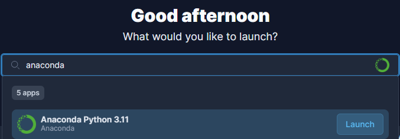
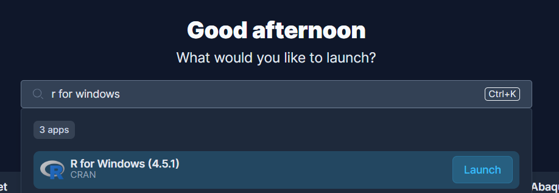
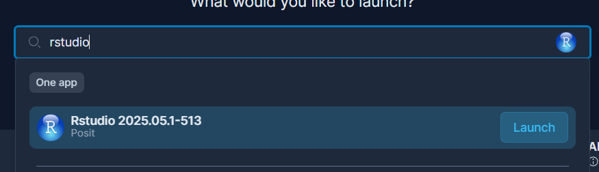

Before starting this practical session, you'll need to set up a few essential tools. Don't worry—we'll keep this brief!

## Required Software {.unnumbered}

### If using AppsAnywhere {.unnumbered}

If you're using [AppsAnywhere](https://appsanywhere.leeds.ac.uk/)(available on university computers or your own laptop):

1.  Open AppsAnywhere on your computer

2.  Search for and launch **Anaconda** (for Python)

    {width="551"}

3.  Search for and launch **VS Code** or **Positron**

4.  For R (optional), search for and launch **R for Windows** first, then **RStudio**

    {width="551"} {width="544"}

### Cloud-based Development Environments (Recommended) {.unnumbered}

For the easiest setup and to ensure everyone is working in a consistent environment, we highly recommend using a cloud-based development environment like **GitHub Codespaces**. This sets up a fully configured development environment in your browser, with all the necessary software pre-installed.

To open this project in GitHub Codespaces, click the link below:

[Open in GitHub Codespaces](https://github.com/codespaces/new/itsleeds/introds?quickstart=1) <!--  -->

**Benefits:**

- **Zero Setup:** No need to install anything on your local machine.
- **Consistent Environment:** Everyone uses the exact same tools and configurations.
- **Powerful:** Runs on cloud servers, providing ample computing resources.
- **Accessible:** Works from any modern web browser.
- **GitHub Account Required:** You need a GitHub account to use Codespaces.
- **Free Usage Tier:** GitHub Codespaces includes 60 hours of free compute time per month for all GitHub accounts (and up to 180 hours via the [GitHub Student Developer Pack](https://education.github.com/pack)).

### If installing on your own laptop {.unnumbered}

This approach is recommended if you want more control over your installations and if you plan to continue using these tools after the session:

#### 1. Development Environment (IDE) {.unnumbered}

An **IDE** (Integrated Development Environment) provides a comprehensive workspace for coding. Popular options include:

**For Python:**

- **VS Code** from [Microsoft](https://code.visualstudio.com/) - Versatile IDE with extensions for Python, R, and more
- **Positron** from [Posit](https://github.com/posit-dev/positron) - Next-generation data science IDE supporting both Python and R

**For R:**

- **RStudio Desktop** (free) from [Posit](https://posit.co/download/rstudio-desktop/) - Specifically designed for R

#### 2. Programming Languages {.unnumbered}

##### Python

Python is a general-purpose programming language widely used for data science, machine learning, and AI.

To be able to run Python code in your own laptop. You have two options:

- **Option A - Global Python:** Every project you create/use will use the same Pyhon installation and packages.

  - Pros: Simple (but slow) initial set up. Once installed, you run code directly without managing environments.
  - Cons: Slower initial setup and fragile over time. Installing or updating a package for one module can break older projects, and sharing your exact setup with teammates or markers is difficult
  - You can install Python in your system using the installers from [python.org](https://www.python.org/downloads/) (version 3.11 or higher recommended) or via [Anaconda](https://www.anaconda.com/download).

- **Option B - Project Environments via `pixi` (Recommended):** Python and all required libraries are self-contained inside each project folder.

  - Pros: Installs in seconds, prevents dependency conflicts between assignments, and guarantees your code runs identically on anyone else's machine.
  - Cons: Requires learning a couple of basic command-line interactions.
  - You will need to install `pixi` just once from [pixi.prefix.dev](https://pixi.prefix.dev/latest/#installation) just once. We will cover how to set up a project in [the first section](1-basics/index.qmd)

Beside the being the fastest way to set everything up for your projects, it also makes it easy to share/reproduce your projects. To do this, you will need to install `pixi` from [pixi.prefix.dev](https://pixi.prefix.dev/latest/#installation) just once.

##### R (Optional)

R is another popular language for statistical computing. You can download the R installers from [CRAN](https://cran.r-project.org/)

## Getting Help {.unnumbered}

If you encounter installation issues:

- Check the [RStudio Support](https://support.posit.co/hc/en-us) page
- Visit [Stack Overflow](https://stackoverflow.com/) for troubleshooting
- Ask during the session!

::: callout-tip
## Pro Tip {.unnumbered}

If you run into installation issues before the session, don't spend too much time troubleshooting. We can help you during the practical!
:::