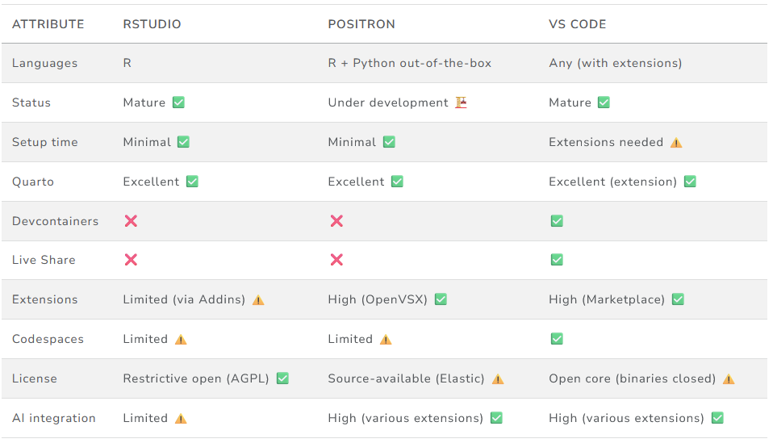

Welcome to this practical introduction to data science! These sessions were developed for MSc students at the Institute for Transport Studies who are new to data science.
We teach modern data science tools (Python, R, Git), plus how to safely use AI tools like Microsoft 365 Copilot and GitHub Copilot.

## About These Sessions

In these practicals, you'll get hands-on experience with data science tools. We'll cover implementations primarily in **Python**. **R** versions of the contents are provided, take your pick!

## Languages

Which language should I use?

There are a number of languages that can be used for data science, including JavaScript/TypeScript, Julia, and MATLAB. However, the two most popular languages are **R** and **Python**. Both are excellent choices for data science, and each has its own strengths, as outlined below.

**Integrated Development Environments (IDEs):** An IDE is a software application that provides comprehensive facilities for writing, testing, and debugging code. Popular IDEs for data science include RStudio, VS Code, and Positron. See the [detailed IDE comparison](https://tdscience.github.io/course/s1.html) for more information.

{#fig-ide-comparison fig-align="center" width="80%"}

::: {.callout-tip}
## Python vs R

If you are unsure which language to pick, we recommend trying both for 10 minutes to see which one "clicks" for you.

**Why choose Python?**

-   **General Purpose:** Python is used for everything from web development to automation, not just data science.
-   **Deep Learning:** It is the industry standard for machine learning and AI frameworks (like `pytorch` and `openai`).
-   **Readability:** Python syntax is designed to be very readable and close to English.
-   **Job Market:** Higher demand for Python skills in industry.

**Why choose R?**

-   **"Batteries included":** Base R has built-in support for data frames, reading data from URLs, and statistical models (like linear regression) without needing extra packages.
-   **Development environments:** RStudio and Positron provide excellent Integrated Development Environments (IDEs) for R that are user-friendly and often feel familiar to those coming from MATLAB.
-   **Stability:** You are less likely to encounter "dependency hell" because CRAN enforces strict checks on package compatibility.
-   **Community:** R has a massive community specifically focused on statistics and data visualization.
:::

## Logistics

-   **Session 1:** Friday 27 November, 09:00 - 12:00 (3 hours)
-   **Session 2:** Wednesday 2 December, 09:00 - 11:00 (2 hours)
-   **Timetable:** [Module Timetable](https://mytimetable.leeds.ac.uk/link?timetable.id=202627!module!AECF29AAE3D6233AD5D55B21751D6E7C) (check for room locations; requires a University of Leeds login to access)

## Schedule

### Session 1: Friday 27 November (09:00 - 12:00)

| Time | Activity |
|------|----------|
| 09:00 - 09:15 | **Welcome & Setup**: Introduction and environment check |
| 09:15 - 09:55 | **Basics**: Development environments (IDEs), Quarto, and basic syntax |
| 09:55 - 10:45 | **Manipulation**: Cleaning and transforming data with pandas |
| 10:45 - 11:00 | *Break* |
| 11:00 - 11:45 | **Visualisation**: Creating plots with matplotlib and seaborn |
| 11:45 - 12:00 | **Session 1 Wrap-up**: Review, reflections, and Q&A |

### Session 2: Wednesday 2 December (09:00 - 11:00)

| Time | Activity |
|------|----------|
| 09:00 - 09:10 | **Welcome Back**: Setup and goals for Session 2 |
| 09:10 - 09:40 | **Workflow Recap**: End-to-end data science workflows |
| 09:40 - 10:25 | **Statistics**: Basic statistical analysis and script debugging (Python, R, SPSS, Excel) |
| 10:25 - 10:35 | *Break* |
| 10:35 - 10:55 | **Collaboration & AI Tools**: Version control with Git/GitHub and AI assistants |
| 10:55 - 11:00 | **Wrap-up**: Next steps and continuing your data science journey |

## What You'll Learn

These sessions cover:

-   **Prerequisites**: Tools and setup you need before getting started
-   **AI Tools & Policy**: Safe and effective use of AI (Microsoft 365 Copilot vs GitHub Copilot)
-   **Practical Exercises**: Hands-on data science tasks using Python and R
-   **Next Steps**: Resources to help you continue learning data science

## Getting Started

Navigate through the sections using the menu. We recommend following them in order if you're new to data science.
<!-- Trigger rebuild Thu 21 May 12:50:22 BST 2026 -->
